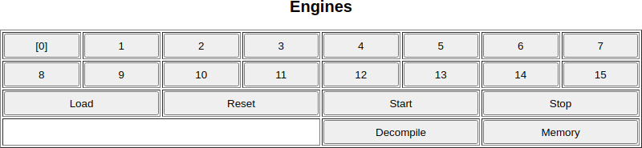
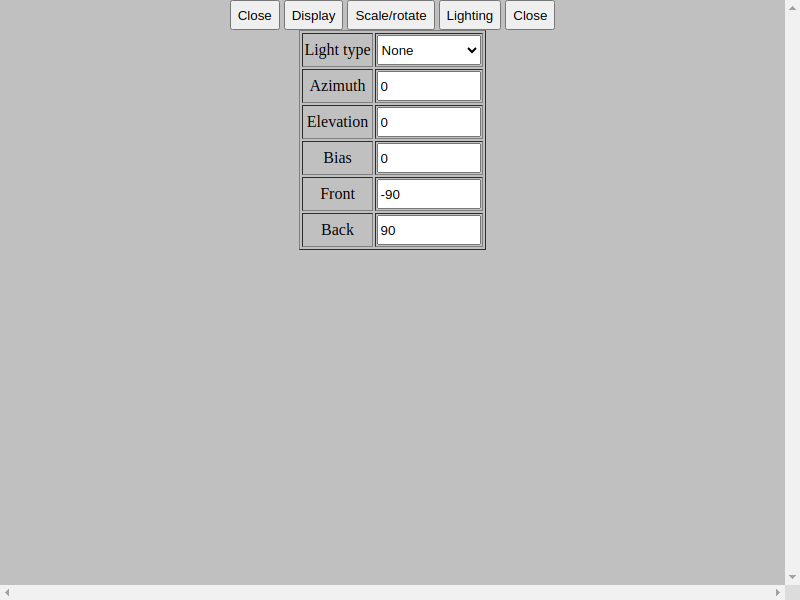

# ScriptSDCC Web

There is the succesor of [ScriptSDCC](https://github.com/andrzejlisek/ScriptSDCC "https://github.com/andrzejlisek/ScriptSDCC") project, which runs in the web browser instead of standalone application\. The **ScriptSDCCWeb** is not binary compatible with old **ScriptSDCC**, but is partially compatible at the source level\. The scripts can be compiled with the [SDCC](https://sdcc.sourceforge.net/ "https://sdcc.sourceforge.net/") software\.

The main differences are:


* Runs in any WASM\-compatible web browser instead of standalone x86 application\.
* Three engines \(**MCS51**, **Z180**, **MOC65C02**\)\.
* Widget forms instead of console and spreadsheet\.
* 16 instances of engines, widget forms and graph canvases\.
* Possibility of manual patch instead of automatically patch\.
* Different multithreading control\.

The general purposes of the ScriptSDCC Web:


* Create any computations, visualizations as script written in C, which can be compiled using SDCC\.
* Elliminate creating GUI for computations, there are needed modules already\.
* The graph visualizations are three dimensional and can be viewed in several perspectives and modes\.

Additional capabilities:


* Visualize memory occupation for any Intel HEX file, even when the file is not compatible with **ScriptSDCC**\.
* Decompilation of MCS51/Z180/MOC65C02 code into assembly language\.

The ScriptSDCC online is available here: [https://andrzejlisek\.github\.io/ScriptSDCCWeb/](https://andrzejlisek.github.io/ScriptSDCCWeb/ "https://andrzejlisek.github.io/ScriptSDCCWeb/") 

# Working principle

The **ScriptSDCC** creates virtual engine compatible with one of 8\-bit processors \(MCS51, Z180 or MOC65C02\)\. The only interface between virtal machine and environment is specified memory page \(range from **XX00h** to **XXFFh**, where **XX** is the number from **00h** to **FFh**\) called as **swap page**\. The most important byte in the **swap page** is the first byte and should be always **00h**\. After executing every instruction, the machine checks the first byte of the **swap page**\. If the value differs than **00h**, the ScriptSDCC makes operation according the read values and restores the **00h**\. The operations are for instance stop the script, draw graphic element, read the value from widget\.

In most cases, the same source code can be compiled for using within all three kinds of machines\. The same source code across different processors varies in the volume and performance even assuming the same virtual machine speed measured by instructions per second\.

# User Interface

The main interface consists of the following sections:


* Script storage
* Engines
* Widget forms
* Graph canvases
* Configuration

## Script storage

This section allows to load and store any script\. You can store scripts in applications for avoid need copying code text every time, when you want to run the same script\.


The script storage consists of the following fields:


* **Storage list** \- The drop\-down list containing the names of the script stored in the storage\.
* **Storage buttons** \- The buttons allowing management of the storage:
  * **Save** \- Save the current script into the storage\. After clisking the button, you will have to input the script name\. For update script saved already, input the name of the script to be updated\.
  * **Load** \- Gets the script selected in the **Storage list** as the current script, in the fields below\.
  * **Remove** \- Remove the script selected in the **Storage list**\. The remove must be confirmed\.
  * **Move up** \- Move the item up in the Storage list\. This allows to manually reorder the **Storage list**\.
  * **Move down** \- Move the item up in the Storage list\. This allows to manually reorder the **Storage list**\.
* **Code text** \- The script code text in **Intel Hex** format\. The script code implies the appropriate settings in the fields below\.
* **Code buttons** \- The buttons related with the **Code text** field:
  * **Clear** \- Clear the code text\.
  * **Copy** \- Copy the code text contents into clipboard\.
  * **Paste** \- Paste the code text contents from the clipboard\. Not all browsers supports the paste text from clipboard\.
* **Engine type** \- The script engine type, the names are the same as used in **SDCC** software\.
* **Code and data** \- Type of virtual machine memory architecture:
  * **Common** \- Code memory and data memory are the same 64kB memory space\. Works with all scripts\.
  * **Separated** \- Code memory is the and data memory are the same 64kB memory space\. Works good with scripts using MCS51 machine, other script may not work\.
* **Swap page** \- The address of the swap page, displayed in the decimal and hexadecimal form\.

## Engines

There are 16 engine slots allowing running up to 16 virtual engine\.



The current slot can be selected by slot numer and will be indicated with brackets\.

Apart from the numbers, there are the following additional buttons:


* **Load** \- Create engine and load the current code from the **Script storage** into the engine\.
* **Reset** \- Reset the virtual engine\.
* **Start** \- Start or resume the virtual engine\.
* **Stop** \- Stop the running engine\.
* **Decompile** \- Display the machine code based on the loaded binary code\. You have to input the starting address as hexadecimal number and decompiled code will be printed in the web browser console\. The main purpose of the function is test and debugging the engine implementation\.
* **Memory** \- Display the memory map, which uses the colors for show the cell state\. If you click the map, there will be shown the byte address\. Then, if you click the **OK** button, the view will be zommed\.
  * The byte purpose, determined while loading the code:
    * **Black** \- usused byte in common memory\.
    * **Dark blue** \- unused byte in code memory, when code and data memory are separated\.
    * **Dark yellow** \- unused byte in data memory, when code and data memory are separated\.
    * **Gray** \- The swap page\.
  * The byte state during the engine running, the colors can be combined according RGB color model principles:
    * **Red** \- The byte is written\.
    * **Green** \- The byte is read\.
    * **Blue** \- The bytes is loaded from the code text\.

Below the **Load** and **Reset** buttons, there are the number of slots containing the engines and the information about the current state, one of the following:


* **Reset** \- The engine is reset and ready for run\.
* **Stop** \- The engine is stopped by user or **stop\(\)** instruction\.
* **End** \- The program reached the end\(\) instruction and the engine can not be resumed\.
* **Error** \- Engine error is occured and can not be resumed\.
* **Number with IPS/kIPS/MIPS unit** \- Engine is running and displays the current number of instructions per second\.

For remove the enine, clear the field **Code text** in **Script storage** section and click the **Load** button in the **Engines** section\.

## Widget forms

There are the 16 widgets forms\. These widgets can be created by script and every form can be open in several instances\.


The widget forms is the primary user interface for input the data to script and get the script output data\. The widgets can be following:


* Label
* Button
* Text field
* Slider
* Multiline field

## Graph canvases

This section consists of 16 canvases, which can be used for visuzalize informations generated by script, such as charts, patterns\. The canvas may use the three\-dimensional drawings and can be open in several instances\.


The canvas can display the information in different perspective, for visualize data as you want\.

For get the display options, you can click on the canvas\. The top row consists of 5 buttons\. The both **Close** buttons closes the settings, the other buttons switches between configuration tabs\.

The examples of the settings are described in the **Readme\_examples\.md** file\.

### Display

This is primary tab about graphics display\.


This tabs contains the following fields:


* **Clear canvas** \- Clears the canvas, not just the canvas display instance\. Use when scripts doest not clear the canvas and graphics are garbage\.
* **Background** \- Color of display background\.
* ***Point size*** \- The shape and size of graphics points:
  * **Positive value** \- Rounded points\.
  * **Zero** \- No display points\.
  * **Negative value** \- Squared points\.
* ***Line size*** \- The line size, zero makes no line display\.
* **Surfaces** \- Display triangle surfaces\. When unchecked, the graphics will be displayed as wireframe\.
* ***Depth min*** \- The minimum depth of points/lines/surfaces \(display Z value\) for display\.
* ***Depth max*** \- The maximum depth of points/lines/surfaces \(display Z value\) for display\.
* **Depth both** \- Change both min/max values simutnaneously, when you change the ***Depth min*** or ***Depth max*** values\.
* **Text** \- Display text labels\.
* **Inverse** \- Invert the painting order for the same depth of several points\. This option may change artifacts, but may cause some artifacts while drawing lines and triangles while lighting is enabled\. This new artifacts will be suppressed by repainting \(resize window, change any drawing parameter including **Inverse**\)\.
* **Step** \- The value change step used when changing value of fields described as italic, in exception of ***Point size*** and ***Line size***\.
* **Zoom** \- The pixel zoom image\. Use for small pictures on big screens\.
* **Buttons** \- The button displayed on the edges for change any of value of field described in italic\. For change any field by buttos, change manually value of these field, then close the settings and click the buttons\. The value is the percentage of display size and can be following:
  * **Positive value** \- Buttons at the left and right edge\.
  * **Zero** \- No buttons\.
  * **Negative value** \- Buttons at the top and bottom edge\.

### Scale/rotate

This tab is about display perspective and every number field has three value related to draw axis\.


The perspective can be changed by scale or rotate the graphics by following fields:


* ***Scale X*** \- The value of data X axis mapped to draw X, Y, Z axis\.
* ***Scale Y*** \- The value of data Z axis mapped to draw X, Y, Z axis\.
* ***Scale Z*** \- The value of data Z axis mapped to draw X, Y, Z axis\.
* ***Scale factor*** \- The factor for values multiplication, which ease the changing\. For instance, the following Scale X and Scale factor values gives the same effect:
  * **1000**, **1000**
  * **10**, **100000**
  * **10000**, **100**
* ***Pan data*** \- Pan the graphics by changing the data values\.
* ***Pan draw*** \- Pan the graphics by changing the draw values\.
* **Rot data order** \- Axis order for rotating graphics by changing data values\.
* ***Rotate data*** \- Rotate graphics by changing data values in angle degrees\.
* **Rot draw order** \- Axis order for rotating graphics by changing draw values\.
* ***Rotate draw*** \- Rotate graphics by changing draw values in angle degrees\.

The values of ***Scale X***, ***Scale Y***, ***Scale Z***, ***Scale factor*** and Pan data are multiplied by **1000**\. Change by **1** makes real change by **0\.001**, change by **1000** makes the real change by **1**\.

### Lighting

This tab allows you to create simplified pseudo\-3D lighting\.



There are two methods of lighting rendering and ligting parameters can be set using these fields:


* **Light type** \- The lighting type:
  * **None** \- Do not use the lighting\.
  * **Distance** \- Use lighting baset on distance from the center\. There is the only method for use light for points\.
  * **Angle** \- Use lighting based on the angle of surfaces and lines\. The points can not be lighted\.
* ***Azimuth*** \- Angle on the screen plane, where is the virtual light source from certer perspective\.
* ***Elevation*** \- The light source against the screen:
  * **Positive value** \- The light is in front of the screen\.
  * **Zero** \- The light is in the screen plane\.
  * **Negative value** \- The light is in back of the screen\.
* ***Bias*** \- The lighting base bias in pixels \(distance lighting\) or in degrees \(angle lighting\)\.
* ***Front***, ***Back*** \- The value in pixels \(distance lighting\) or in degrees \(angle lighting\) to fade to dark or light:
  * **Positive value** \- Fade to background color \(black by default\)\.
  * **Zero** \- No fade\.
  * **Positive value** \- Fade to color opposite from background \(white by default\)\.

## Configuration

The section is for change the application configuration\.


This has the following parameters:


* **Button layout** \- Layout of number buttons in the **Engines**, **Widget forms** and **Graph canvases** sections\. Change of the setting requires **ScriptSDCC** restart\.
* **Button and field height** \- The height of all button and fields, userfull for use **ScriptSDCC** on small touch screen\. Change of the setting requires **ScriptSDCC** restart\.
* **Instructions x1000 per period** \- The engine runs instructions in packets consisting from several thousand to several millions instruction\. You should choose the optimal value experimentally:
  * **Too low value** \- Running speed becomes slower and can freeze the web browser\.
  * **Too high value** \- The engine responsivity during the running becomes longer\.
* **Graph repaint period in ms** \- The time in milliseconds between repainting open graph canvases and memory maps\.
* **Widget font size** \- Font size used in widgets\.
* **Graph font size** \- Font size used in graphs\.

# Preparing the script

With **ScriptSDCC**, there is supplied the library, which provides the functions to use with **ScriptSDCC** engine\. The most important library file is the **core\.h**, other libraries uses this library\.

The script is the program written in C language, compatible with the SDCC\. Before compiling, you have to create the file \_\.h within the library directory, which has the following contents:


* One of the defined macros without values, depending on engine type:
  * **engine\_mcs51**
  * **engine\_z180**
  * **engine\_mos65c02**
* The **mem\_swap** constant, which determines the swap memory address\.

For example, the file for **MCS51** with swap page **0x7F** will the following contents:

```
#define engine_mcs51
#define mem_swap 0x7F00
```

The **\_\.h** file is mentionet to bi include in the **core\.h** file\. The compilation process is standard compilation procedure designed for the SDCC\.

After compiling, you will have the file with **\.ihx** extension, its contents must be pasted into the **Code text** field in the **Script storage** section\.

Alternatively, the directory containing the **\_h\.** file should be provided as addidional library directory in the SDCC command line\.

## Library functions and examples

The library functions and example scripts are described in the **Readme\_library\.md** and **Readme\_examples\.md** files\.

The examples are in the **Scripts** directory\. Within the Scripts, there are following directories and files:


* **Lib** \- Standard **ScriptSDCC** library\.
* **Src** \- Source codes of all example scripts
* **Bin\_MCS51** \- Binary hex files of example scripts for **MCS51** engine\.
* **Bin\_Z180** \- Binary hex files of example scripts for **Z180** engine\.
* **Bin\_MOS65C02** \- Binary hex files of example scripts for **MOS65C02** engine\.
* **Temp** \- Temporary directory, its should be empty\.
* **CompileAllScripts\.sh** \- Bash script, which removes all binary files and compiles all example script\. The file is designed for Linux, for other operating system, you should write own script\.
* **Compile\_MCS51\.sh** \- Bash script, which creates the **\_\.h** file and compiles script for MCS51 engine\. The script is user by **CompileAllScripts\.sh bash script\.**
* **Compile\_Z180\.sh** \- Bash script, which creates the **\_\.h** file and compiles script for Z180 engine\. The script is user by **CompileAllScripts\.sh bash script\.**
* **Compile\_MOS65C02\.sh** \- Bash script, which creates the **\_\.h** file and compiles script for MOS65C02 engine\. The script is user by **CompileAllScripts\.sh bash script\.**

For knowledge, how to create the **\_\.h** file and how to compile script for **ScriptSDCC**, you should view the **\*\.sh** files using any Notepad\-like text editor\. The files within **Bin\_\*** subdirectories are ready for use within the **ScriptSDCC**\. Remember to select apropriate engine type and swap page while loading the script\. Every example script can be used with every of all engiine types\.


 

