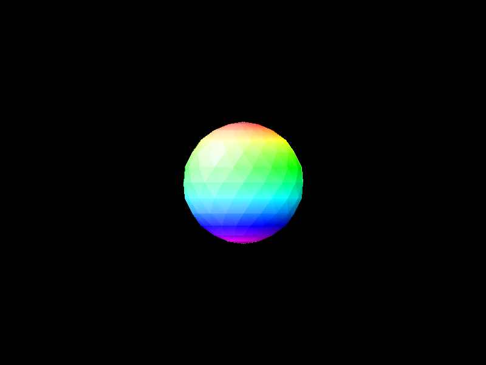
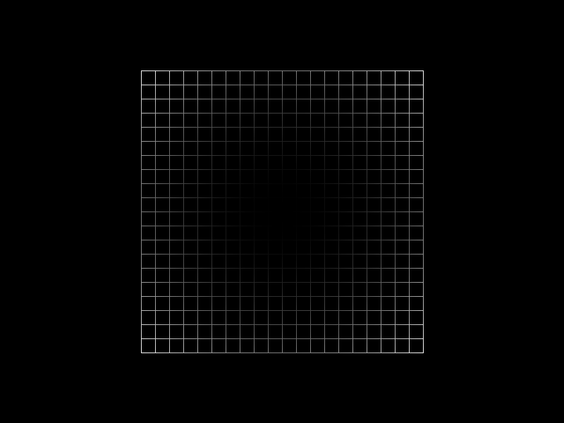
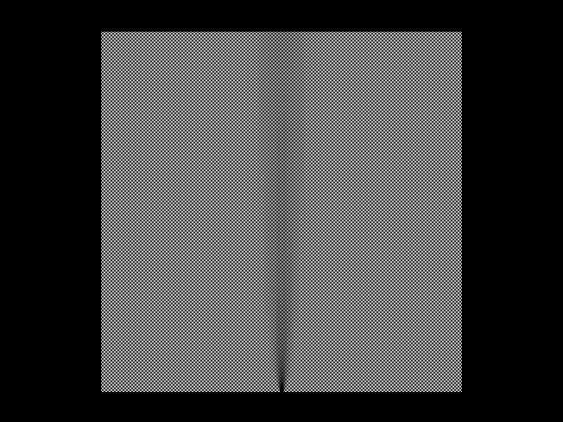
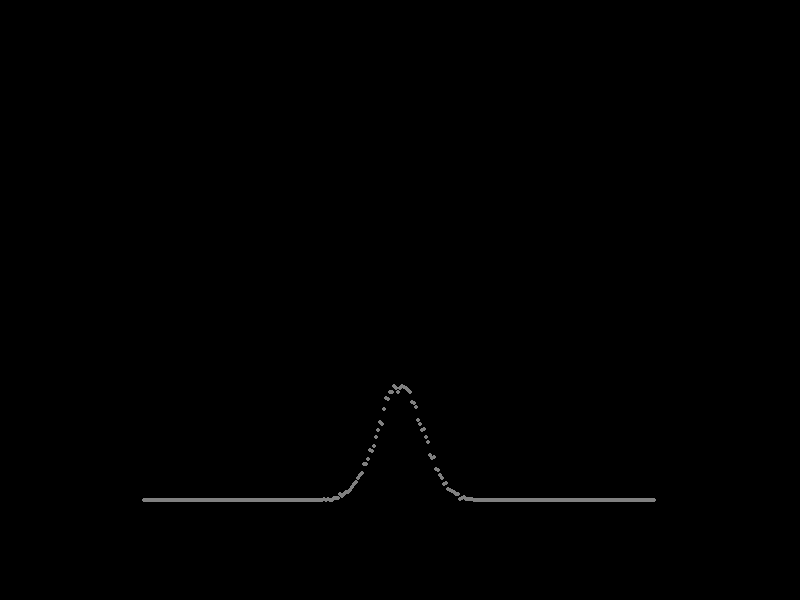

# ScriptSDCC demonstration examples

The ScriptSDCC is provided with several script for demonstrate the input/outpu capabilities and library function usage\.

Most of the scripts can be run on every engine and if this script uses the widget form or graph canvas, its uses form/canvas at the same slot as script engine\. For instance, if the script uses two canvases and you will run the script into engine slot 7, the script wil use the canvas 7 and 8\. This approach allows to load and runseveral scripts at once\.

Some script does not applies the approach and this fact is mentioned in description\. For convinience, the forms and canvases are pointed as **first**, **second** and so on\. The **first** canvas meand canvas at the same number as script engine\.

Most of scripts are designed for use the **7F** as swap page\. Some scripts are designed to use the **BF** as swap page and the fact will be included in the script description\.

# Compilation scripts

There are compile scripts, which are prepared for use with **bash** or compatible interpreter\. The main file is **CompileAllScripts\.sh**, which performs compilation of all scripts for all three engines\. The compiled files will be locaten in the **Bin\_MCS51**, **Bin\_Z180** and **Bin\_MOS65C02** subdirectories\. There are text files containing binary code in Intel Hex format\. For run the file in the **ScriptSDCC** application, paste file contents in the **Code text** field, select appropriate engine type and swap memory page\. Every script can run in common memory\.

The script assumes, that the libraries are in the **Lib** subdirectory and the source files are in **Src** subdirectory\. The script requires the **Temp** subdirectory, which should be empty\.

## Engine compile script

The **CompileAllScripts\.sh** runs three engine compiling script, **Compile\_MCS51\.sh**, **Compile\_Z180\.sh** and **Compile\_MOS65C02\.sh** script for each source file, every of the script takes four parameters:


* Swap page as hexadecimal address for write into **\_\.h** temporary library file\.
* Library absolute path\.
* Script absolute path and file name without excension\.
* Additional compiler parameters when required\.

Each compiling script compiles source in following steps:


* Remove **\_\.h** file if the file exists\.
* Create appropriate **\_\.h** file, according used swap page and engine type\.
* Compile source code using **sdcc** command\.
* Move the Intel Hex file into appropriate binary directory\.
* Remove **\_\.h** file\.

## MSC51 engine

This engine requires specify data memory location and data memory size for use to common memory and outside the swap page\. This script supports swap pages: **7F** and **BF**\. According the swap page, the script rung compile command with different data location and size using the **\-\-xram\-loc** and **\-\-xram\-size** parameters\. The memory model is **\-\-model\-large** for allocate variables in data memory instead of the internal memory\.

## Z180 engine

The compiling script uses the **\-\-no\-peep** parameter for disable peephole optimization, because in the SDCC 4\.4\.0 there is bug in this feature, which sometimes may cause incorrect script working\.

If the compiled script uses interrupts, there is required to use the custom startup library by parameter **\-\-no\-std\-crt0**, using the **Lib/Z180\_Lib/crt0\_ints\.rel** file\. The library is modified Z80 startup library supplied with SDCC 4\.4\.0\.

## MOS65C02 engine

The compiling script uses the **\-\-model\-large** parameter for allocate all variables in the data memory instead of the zero page memory\.

If the compiled script uses interrupts, there is required to use the custom startup library by parameter **\-\-no\-std\-crt0**, using the **Lib/MOC65C02\_Lib/crt0\_ints\.rel** file\. The library is modified MOC6502 startup library supplied with SDCC 4\.4\.0\.

# Trefoil\.c

The script draws the trefoil knots on the first and second canvas using the parametric functions in three dimensional space\. The script facilitates vieweing simple wireframe graphics without lighting and with distance lighting\. The angle lighting is useless\.

The usage is very simple\. Run the script ant view canvases when the script finishes and the engine get into end state\. The knots are defined by parametric formulas, there T is fom 0 to 2\*pi\.

For three dimensional view, you can use distance lighting at the following parameters:


* Light type: Distance
* Azimuth: 0
* Elevation: 90
* Bias: 0
* Front: \-120
* Back: 120

The nearer parts is brighter and the further parts is darker\.

For more clarity, the point size and line size should be at least 5\.

## Knot in the first canvas

There is parametric formula for the first knot:

```
X = sin(T) + 2 * sin(2*T)
Y = cos(T) - 2 * cos(2*T)
Z = 0 - sin(3*T)
```

There is the knot view from 0 to 180 degrees around the vertical axis, by 30 degrees\. The rotation is achieved by modifying the **Rotate draw** parameter for these value triplets:


* 0, 0, 0
* 0, 30, 0
* 0, 60, 0
* 0, 90, 0
* 0, 120, 0
* 0, 150, 0
* 0, 180, 0


## Knot in the second canvas

The original formula of the second knot is slightly modified to achieve the same orientation as the first trefoil knot:

```
X = (2 + cos(3*T)) * sin(2*T)
Y = (2 + cos(3*T)) * cos(2*T) * (-1)
Z = sin(3*T)
```

There is the knot view from 0 to 180 degrees around the vertical axis, by 30 degrees\. The rotation is achieved by modifying the **Rotate draw** parameter for these value triplets:


* 0, 0, 0
* 0, 30, 0
* 0, 60, 0
* 0, 90, 0
* 0, 120, 0
* 0, 150, 0
* 0, 180, 0


# CubeOctahedron\.c

The script draws three figures in the three canvases using surfaces\. This script facilitates demonstration of various projections and angle lighting\. After load the script, just run and wait for the end state\.

## Cube in the first canvas

In the first canvas, there is the cube, which is colored according the Red\-Green\-Blue color model, so two opposite vertices are black and white, the other vertices are in primary colors in Red\-Green\-Blue and Cyan\-Magenta\-Yellow model\. One dimension of the cube represents changing magnitude of the one primary color\.

The primary view by default, is just a front face:


The same cube, where are modified Scale/Rotate:


* Scale X: 1000, 0, 0
* Scale Y: 0, 1000, 0
* Scale Z: \-500, \-500, 1000

The side faces will be visible in dimetric projection


The same cube can be viewen in isometric projection with these settings:


* Scale X: 700, \-700, 700
* Scale Y: 0, 1000, 700
* Scale Z: \-700, \-700, 700


In this view parameters, the **Depth max** can be limited to 80 and there vill bi visible the cross section\.


## Octahedron in the second canvas

The octahedron is colored using the pure colors only, each vertex has different color\.

The normal view of the octahedron are just four triangles:


The angle light makes the polyhedron more visible, there are used following lighting parameters:


* Light type: Angle
* Azimuth: 0
* Elevation: 0
* Bias: 0
* Front: \-90
* Back: 90

This view requires the **Inverse** to be on\.


The octahedron can be viewet rotated by these parameters:


* Rot draw order: YZX
* Rotate draw: \-20, 20, 0


The same view with changed light azimuth to 45\.


When the light is turned off, the lighting mode is set to none, there polyhedron is less visible:


If the surface view is turned off, there can be visible all the edges\.


## Ball in the third canvas

Actually, the polyhedron in the third canvas is not a ball, bat its shape is similat to ball and consists of many triangles\. These triangles will be visible, while angle lighting is used, but the distance lighting alho highlightes the shape similar to sphere\.

Initial view is not like the ball, is rather like the rainbow circle:


The distance lighting makes te ball more visible as ball, there are following parameters:


* Light type: Distance
* Azimuth: \-45
* Elevation: 45
* Bias: 0
* Front: \-90
* Back: 90


Changing lighting type into angle, makes the ball more natural, with triangles visible:


* Light type: Angle



Change the sign of front i back makes the opposite direction of light:


* Light type: Angle
* Front: 90
* Back: \-90


# Paraboloid\.c

The script user three canvases fot three variants of the same paraboloid\. The paraboloid can be viewed in various projections and can be lighted both using distance and angle lighting\.

For more clarity, all pictures of this script, are presented using enlarged scale factor:


* Scale factor: 2000, 2000, 2000

## Wireframe in the first canvas

In the first canvas, there is the wireframe version, which consists of squares\. There is view from top\. and the depth can be visible by distance light:


* Light type: Distance
* Azimuth: 0
* Elevation: 90
* Bias: 0
* Front \-200
* Back: 200



The drawing can be rotated to view the paraboloid by the following parameters:


* Rot draw order: XYZ
* Rotate draw: 90, 20, 0

The lighting are the following parameters:


* Light type: Distance
* Azimuth: 0
* Elevation: 90
* Bias: 0
* Front \-400
* Back: 400


## Two surface versions in the second and third canvas

In the two canvases, there is the same drawing\. The only difference is in the triangle shaping manner\. In the second canvas, there are two triangles per one square making graph asymmetrical, while in the third canvas, theree are four triangles per one square, making graph symmetrical\. The four triangles are achieved by additional point in the middle of the square, where coordinates i average of square corners coordinates\.

There is wireframe comparison between thw approaches by display without surfaces and with distace lighting:


* Light type: Distance
* Azimuth: 0
* Elevation: 90
* Bias: 0
* Front \-300
* Back: 300

The second canvas, two triangles per square:


The third canvas, four triangles per square:


The both graphs looks similarly with lighted surfaces\. The next examples will be shown from the third canvas\.

If the light is based on the distance, the bright points are the nearer than the sceen and the dark points are further than the screen:


* Light type: Distance
* Azimuth: 0
* Elevation: 90
* Bias: 0
* Front \-90
* Back: 90


If the light is based on the angle, there is not known if the extremum is nearer or further than the screen, because angle to the light rays are the same at the both figure sides:


* Light type: Angle
* Azimuth: 0
* Elevation: 90
* Bias: 0
* Front \-70
* Back: 70


The paraboloid should be rotated for more visibility:


* Rot draw order: XYZ
* Rotate draw: 90, 20, 0

The angle lighting has the following parameters:


* Light type: Angle
* Azimuth: 0
* Elevation: 0
* Bias: 0
* Front \-70
* Back: 70

For redure artifacts, the **Inverse** is on and the result id the paraboloid, the lighting appears to be from the top to the bottom:


If the Azimuth is at the opposite side, the paraboloid appears to be lighetd from the bottom, to the top:


* Light type: Angle
* Azimuth: 180
* Elevation: 0
* Bias: 0
* Front \-70
* Back: 70

The alternative method for shange light side is swapping front and back values:


* Light type: Angle
* Azimuth: 0
* Elevation: 0
* Bias: 0
* Front 70
* Back: \-70


# Eratosthenes\.c

The script demonstrates the text rendering abilities and using Unicode characters for render the Eratosthenes sieve\. Whole information has the single base point in the space and all text are rendered by moving text offset\. For view the sieve, run the script and open the first canvas\. Not any point and lines are rendered\.


# GaltonBoard\.c

The script uses the local memory provided by **memo\.h** library, because needs big dwo dimensional array consisting of about 256k items\.

There is the simulation of big Galton board with 512 steps\. In every step, the initial value is incremented or decremented by 1, the operation is chooser by random\. The procedure is repeated 16384 and the board is painted in the first canvas every 2048 iterations\. In the second canvas, there is textually indicated the progress, which consists of 16 parts, like the board is repainted 16 times during the script\.

For simulate, run the script and wait e longer while until script ends\. Of course, yu can sto the script earlier, but there will ledd cumulated pathes\. After ending or stopping the script, you can observe the final board containing all cumulated pathes, which is presented as point cloud\. By setting the parameters, you can see for example top view of whole board, the perspective view or one iteration, which shape as similar to normal distribution chart\.

After finishing the drawing, you can see the filled board\.

At the default view, the pathes are not visible\. The black hole is caused by the default depth limit from \-1000 to 1000:


Extending the depth limit or reducing the Z scale solves the problem with black hole\. Extending the maximum depth to 10000 is enough\. For make the cumulated pathes visible, there is applied distant light with the following parameters:


* Light type: Distance
* Azimuth: 0
* Elevation: 90
* Bias: 500
* Front \-600
* Back: 600


For make more visible the begin of the path, you can change the bias, front and back values:


* Light type: Distance
* Azimuth: 0
* Elevation: 90
* Bias: 2000
* Front \-2300
* Back: 2300


The negative light can be achieved by two ways\.

The first waay is change elevation into negative:


* Light type: Distance
* Azimuth: 0
* Elevation: \-90
* Bias: 2000
* Front \-2300
* Back: 2300

The second way is change the sign of the front and back values:


* Light type: Distance
* Azimuth: 0
* Elevation: 90
* Bias: 2000
* Front 2300
* Back: \-2300

Both changes gives the same result:



You can get the pseudo three dimensional view by turning of the light and set the following parameters for display:


* Scale X: 1000, 0, 0
* Scale Y: 200, 200, 1000
* Scale Z: 0, 200, 0
* Pan draw: 0, 200, 0


The viev can be reduced to the path view by changing the scale Y:


* Scale Y: 200, 200, 1000
* Pan draw: 0, 200, \-257

The third value is important for the slicing to view the fragment, now, there are merged all path steps\. The panning in Z is for more convinient slicing\.


The fragment can be choosen by depth min and depth max\. For more visibility, the point size should be 4\. Now, the min and max depth represent the minimum and maximum path step to be viewed\. The begining, before the first random is not shown in this script, the forst step is after the first random and is assigned to the 1 at the depth\. In this case, the Z scale should be reduced to 50 to show points:


* Depth min: 1
* Depth max: 1
* Scale X: 1000, 0, 0
* Scale Y: 0, 0, 1000
* Scale Z: 0, 50, 0
* Pan draw: 0, 200, \-257

The points are not at the same height, because there are iterated and cumulated random movement from the middle\.


The another example is 16 for minimum and maximum depth and shows the smooth distribution\.


The last stp is 512 and setting the minimum and maximum depth for 512 displays the final, for more visible, the Scale Z should be increased:


* Scale Z: 0, 200, 0



There is also possible to view the across the board, especially to view, how may pathes passes accross the middle line, for achieve this effect, you should set the scale as following:


* Scale X: 0, 0, 1000
* Scale Y: 1000, 0, 0
* Scale Z: 0, 100, 0
* Pan draw: 0, 200, 0
* Depth min: 0
* Depth max: 0


Instead of depth range, you can change the pan in Z axis\. For example, the view presents the patches on the line in distance of 8 from the middle:


* Pan draw: 0, 200, 8


Other example with another pan:


* Pan draw: 0, 200, 20


# PascalTriangle\.c

The script uses two widgets forms, on botth forms created the multiline text\.

In the first form, the script print the numbers of Pascal triangle:


In the second form, the script print the odd numbers as brackets and even numbers as spaces, and the result is similar to Sierpinski triangle\.


# ColorWheel\.c

The script user one widget form and one graph canvas for display the color wheel with labels\. After running the script, its quicly moves into stop state due to use the **stop\(\)** command inside the script code\. In the form, you can change the display parameters\. For change the radius or label distance, change the values of fields **Radius** and **Label distance** in the form, then click the **Apply** button\. The script will be started automatically for get new values and repaint the color wheel\.


The three sliders sets the middle point of the color wheel\. Every slider also runs the script as event, so you can observe the color change immediatelly\.

White middlepoint:


Black middlepoint:


The script is the simple example, how to get the parameters from user and generate graph based on the parameter and wait for repeat after changing the parameters\. The script works in the infinite loop, where in every iteration the script is stopped\.

# Spirograph\.c

This script simulates the spirograph tool by drawing hypotrochoid, epitrochoid and other similar closed curves\. The script allow for compare performance between standard implementation of operations \(emultiplication, sine and cosine\) and implementation using engine by **mathx\.h** library\.

Script used one widget form and two canvases\. After script running, its almost immediatel moves into stop state\. In the form, there are following parameters of drawing curve:


* **Points per pass** \- Number of curve points per single pass, the parameter not affects the shape, but the higher number of points makes the curve smoother in cost of longer drawing process\.
* **Number of passes** \- The required number of passes depends on radiuses\. If the number of passes is too low, the curve is incomplete, but the number of passes is too high, the curve is painted multiple times unecessary\.
* **Stator radius** \- The radius of the stationary circle, which is base for the curve\. The radius substantially affects the curve pattern\.
* **Rotor radius** \- The radius of rotating circle, which moves around the stationary circle\. The radius substantially affects the curve pattern\.
* **Drawing factor x100** \- There is the radio of drawing radius to rotor radius\. The **100** means, that drawing radius is the same as rotor radius\. The factor less than **100** makes smoother curve, the factor greater than 100 in some cases, makes additional loops in the curve\.
* **Drawing size** \- The factor of pattern size\. You can change the value for give smaller or greater patter without changing the **Stator radius** and **Rotor radius**\.
* **Standard &#124; Engine** \- Two switches, which allows to use standard algorithm and engine operations\. this allow to measure and compare the both algorithm\.

Below the fields, there are four buttons, every button creates different curve based on the same parameters\. Every button has two numbers, initially replaced by **?** character\. After drawing, the first number represents the number of instructions executed for drawing using standard algorithm, the second number represents the number of instructions executed for drawing using engine algorithms\. Displaying both numbers at once, you can compare the speed using both methods\.

There is example after drafing all forur curves by both algorighms:


During the drawing, every button shows the progress\. After drawing, in the first canvas there is painted selected curve, and in the second canvas, there is written parametric formula used for painting the curve\. The program uses the text move function for place all elements of formula\. For placing the number, there is used the text buffer\. The views are displayed by increased scale factor in graph:


* Scale factor: 1500, 1500, 1500

The hypotrochoid is the rotor inside the stator:


The other inner curve derivated from hypotrochoid:


The epitrochoid is the rotor outside the stator:


The other inner curve derivated from epitrochoid:


# FormulaChart\.c

The script purpores are the following:


* Demonstrate multithreading and shared memory spaces \(the **memo\.h** library\)\.
* Compare computation speed using standard implementation and engine functions \(the **mathx\.h** library\)\.

For simplify implementation, there is important, in which engine slot the script is running\. The main thread or the only thread must be run in **engine 0**\. The other threads, are running in next engines, for example, the second thread is run in **engine 1** and so on\.

For instance, if you want to run 4 threads, load this script into **engine 0**, **engine 1**, **engine 2** and **engine 3**\. After loading the script, run them by clicking the **Start** button once, the script should by in **Stop** state\.

This script draw the array of points, which meets the equation:

```
  a[1]*x^3 + a[2]*x^2*y + a[3]*x*y^2 + a[4]*x^2 + a[5]*x*y + a[6]*y^2 + a[7]*x + a[8]*y + a[9]
------------------------------------------------------------------------------------------------ = 0
  b[1]*x^3 + b[2]*x^2*y + b[3]*x*y^2 + b[4]*x^2 + b[5]*x*y + b[6]*y^2 + b[7]*x + b[8]*y + b[9]
```

The vectors **a\[1\.\.9\]** and **b\[1\.\.9\]** are the parameters from user\. Such equation allows to get various plane curves\.

In the **widget form 0**, there are formula parameters for numerator \(the **a\[1\.\.9\]** vector\), for denominator \(the **b\[1\.\.9\]** vector\)\. The fields accepts fractional number using both dot and comma as separator character\.

The **Tolerance** field is the maximum allowed difference between formula value and zero\. The field accepts fractional number using both dot and comma as separator character\.

The **Line**, **Parabola**, **Hyperbola** and **Circle** buttons inputs the sample parameters for that four curves\.

Before drawing the chart, you should set the drawing parameters in the **widget form 1**\.

These parameters are in three sections:


* **Coordinates** \- The **Minimum**, **Maximum** and **Step** of **X** and **Y** coordinates\. The Step strongly affects the drawing speed, the higher step value makes the drawing faster, but less accurate\.
* **Colors** \- Three colors used for drawing points:
  * **True** \- The color of points, which meets the equation within tolerance\. These points makes the curve chart\.
  * **False** \- The points, which not meets the equation\. These points makes the background\.
  * **Div 0** \- The points, which makes denominator equals to **0** and the formula calculation is not possible due to division by zero\.
* **Threads** \- The number of threads used for drawing\. The number above **1** requires thread preparation described as above\.

In the both forms, there are the two botton for drawing:


* **Draw chart \- standard** \- Draw chard using standard implementation of computation, inside the engine\.
* **Draw chart \- engine** \- Draw chard using engine implementation of computation, outside the engine\.

If you click one of the **Draw chart** buttons, the chart drawing will be performed and in the button, there will be indicated the draawing progress of the first thread\. If you use more threads, after finishing the first thread, the script will wait after finishing all other threads\.

## Example ellipse

For example, assume, there is need to draw ellipse being 700 width and 500 height\. The horizontal radius is 350 and vertical radius is 250\. The ellipse formula is following:

```
   X * X         Y * Y
----------- + ----------- = 1
 350 * 350     250 * 250
```

After the calculating and getting common denominator by multiplicating, the same formula is presents:

```
 62500 * X * X     122500 * Y * Y     7656250000
--------------- + ---------------- = ------------
  7656250000         7656250000       7656250000
```

There is possible to reduce two zeroes from constant values and create the general formula by moving between sides:

```
  625 * X * X  +  1225 * Y * Y  -  76562500
--------------------------------------------- = 0
                  76562500
```

The formula can be further reduced by dividing every constant by 25:

```
  25 * X * X  +  49 * Y * Y  -  3062500
----------------------------------------- = 0
                  3062500
```

The widget form 0 with this formula and tolerance:


The widget form 1 with drawing configuration on single thread:


The graph 0 showing the ellipse:


# GraphRecursion\.c

This script demonstrates the usage of the **\_\_reentrant** keyword and show necessary of using this word for recursive calling\. In the browser console, there is printed every function call and return\.

The script draws the set of 256 squares arranged as 16x16 layout\. The recursion is used for calculating the square coordinates\.

The base algorithm for the depth 0, is drawing one rectangle at specified coordinates\. For the depth greater 0, the function calls himself four times, for the four quarters of area defined by provided coordinates\.

If you compile the script without **\_\_reentrant** keyword, its may malfunct in **MCS51** and **MOC6502** engines\. In the **Z180** engine, the **\_\_reentrant** keyword does not matter and is ignored\.

This display user the 2000 factor:


* Scale factor: 2000, 2000, 2000


The depth axis is also used in recursive function\. You can view the depth with the following parameters:


* Scale X: 1000, 0, 0
* Scale Y: 200, 100, 0
* Scale Z: 0, 200, 0
* Scale factor: 2000, 2000, 2000


# InterruptDemo\.c

The script demonstrates the widget events including interrupt\. There is only script, whish must be compilet with non\-standard **crt0** library for **Z180** and **MCS65C02** engines, or the interrupt will not work\. For the **MCS51** engine, the interrupt will work with standard compilation\.

The script creates single form and runs within infinity loop\. The form consists of one label and seven buttons with switches\.

The label shows the iteration counter, the switch next to the label, enables script stop every iteration, which allows various event scenarios, which can be used in the scripts\.

Every button raises the event as described on the button\. The event routine changes the switch to the opposite state\. Manually changing the switch does not matter\.

You can test the following scenarios:


* Script is running, the switch next to the counter is disabled and counter continuously increases:
  * Every button does not affect the script running, its only switchest all switches next to the buttons\.
* Script is stopped, the switch next to the counter is disabled, you can get this scenario by enable and disable the switch:
  * The three button at the left columns does not run the script, but raises the events implemented as interrupts\.
  * Every of the four buttons at the right columns runs the script, as you can see as increasing the counter\.
* Script is stopped, the switch next to the counter is enabled:
  * The three button at the left columns does not affect the iteration counter\.
  * Every of the four buttons at the right columns runs the script, iteration counter is incremented by 1 and the script is stopped again\.

There is state after click once every button and stopped after 100 iterations:


# NumCalc\.c

The script demonstrates the usage of the **num** library as multi register calculator\.

The calculator has 26 registers named from 26 letters and uses two widget forms\. The library allows to compute using fixed point numbers consisting much more digits than standard C type and the number 

The first forms consists of the view for all registers\. The current register is indicated by brackets and the current register can be switched by clicking the letter\.

By default, the current register is **X**, the **P** register contains the **pi** constant and the **E** register contains the **e** constant\.

The field below, allow to input the formula, the button **Compute** computer the formula and shows the result in the selected register\. The **Clear** button clears the field\.

The **Page** button changes the displayed page of two pages containin the registers\.


There is display function only, which not affect the script working\.

The second form is arranged similarly as ordinary calculator\.


These buttons inputs the all possible formula elements and there is special buttons:


* **PREV** \- Scroll the register list to previous page\.
* **NEXT** \- Scroll the register list to next page\.
* **CLR** \- Clear the formula\.
* **BACK** \- Remove the last character\.
* **ENTER** \- Enter the formula to compute and display the result\.

While computing, in the web console, there is printed detected formula token and the RPN form of the formula, which is used for computation using the stack\.

## Usage example

In the second form, you can write the formula, after clicking the **ENTER** button, the formula will be computed and result will be displayed:


In the first form, the result will be also visible under the selected register:


You can change the default register and use any register in the further calculations\. In the first form, you can manually input the formula and click the **Compute** button to compute this formula and display the result:


## Formula syntax

The formula can consists of numbers, letters and operator\. The spaces within formula are ignored\. The infinity number being of result of division be zero and some functions will be represented by maximum possible number or minimum possible number\.


* Numbers:
  * Use the decimal fraction notation, with the single decimal separator as comma or dot\.
  * The negative number should be input using the **\\** \(backslach\) instead of **s** \(minus\) characted to distinguish the character from the subtract operation\.
  * The scientific or engineering number notation is not possible\. The only supported notation is decimal with single comma or dot as integer/fraction separator\.
* Letters:
  * The letter case is ignored\.
  * The "negative" letter does not exists\. For input the opposite number from the **R** register, input formula **\(0\-R\)**\.
  * The single letter represent the register, from which number should be substituted within computing\.
* Operations, the argument can be single number, sungle register or other formula\. For example, the first argument is presented by **X**, and the second is presented by **Y**\.
  * One argument operation consists of name and argument should be in brackets\. There are the following operations:
    * **SIN\(X\)** \- Sine value of angle in radians\.
    * **COS\(X\)** \- Coine value of angle in radians\.
    * **TAN\(X\)** \- Tangent value of angle in radians\.
    * **COT\(X\)** \- Cotangent value of angle in radians\.
    * **SEC\(X\)** \- Secant value of angle in radians\.
    * **CSC\(X\)** \- Cosecant value of angle in radians\.
  * Two argument operations as the standard arithmetic operations:
    * **\+** \- Addition\.
    * **\-** \- Subtraction\.
    * **\*** \- Multiplication\.
    * **/** \- Division, the division by 0 will generate maximum possible number or minimum possible number depending on sign of divident\.
  * Two argument operations as the name, the argument separator is semicolon character:
    * **EXP\(X;Y\)** \- Exponental function, the **X** raised to the power of **Y**\.
    * **ROOT\(X;Y\)** \- The **Y**\-th root of **X**, the Y must be integer number, the fraction part wil be ignored\.

There is examples of the correct formulas:


* 4562
* \\47
* 6\*4
* A\*4
* 3\*\\2
* \\2\+3
* S
* SIN\(P/2\)
* SIN\(P/2\)\+COS\(P/2\)
* ROOT\(2;SIN\(\\1\.56\)\)
* ROOT\(2;SIN\(0\-1\.56\)\)
* ROOT\(2;SIN\(0\-C\)\)
* TAN\(2\*P\+K\)


 

